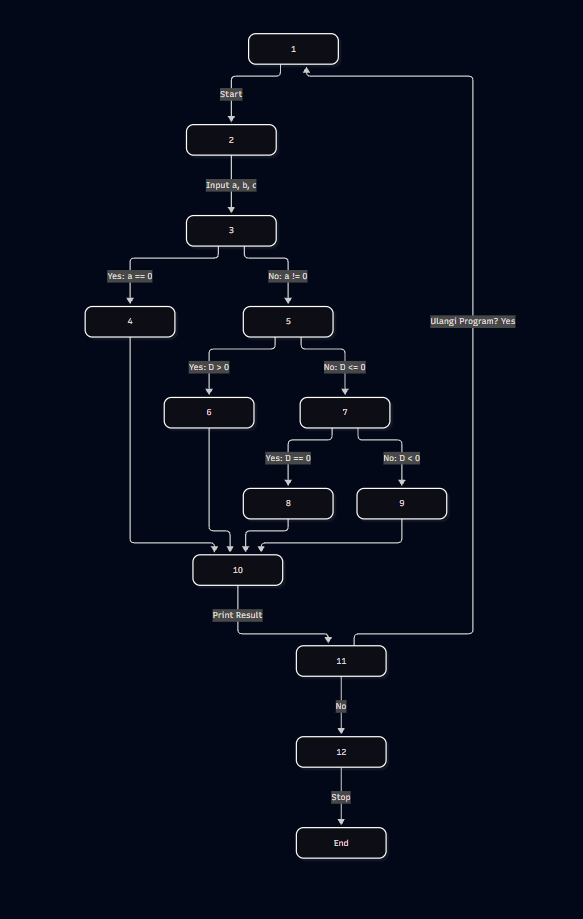

# Analisis CFG Program Persamaan Kuadrat

## 1. Penjelasan Persamaan Kuadrat

Program pada CFG digunakan untuk menentukan hasil dari persamaan kuadrat:

\[
ax^2 + bx + c = 0
\]

Nilai diskriminan (`D`) dihitung dengan:

\[
D = b^2 - 4ac
\]

Hasil persamaan ditentukan berdasarkan nilai `a` dan `D`:

- Jika `a = 0`, persamaan bukan persamaan kuadrat.
- Jika `a ≠ 0` dan `D > 0`, terdapat **2 akar real berbeda**.
- Jika `a ≠ 0` dan `D = 0`, terdapat **1 akar real kembar**.
- Jika `a ≠ 0` dan `D < 0`, tidak terdapat akar real.

Rumus akar:

\[
x_1 = \frac{-b+\sqrt{D}}{2a}
\]

\[
x_2 = \frac{-b-\sqrt{D}}{2a}
\]

---

## 2. Control Flow Graph (CFG)



Alur utama program:

```text
Start
  ↓
Input a, b, c
  ↓
a = 0 ?
 ├── Yes → bukan persamaan kuadrat
 └── No  → hitung/cek D
              ↓
            D > 0 ?
             ├── Yes → 2 akar real
             └── No  → D = 0 ?
                         ├── Yes → 1 akar kembar
                         └── No  → D < 0 → tidak ada akar real
                                      ↓
                                  Print Result
                                      ↓
                               Ulangi Program?
                                ├── Yes → kembali ke awal
                                └── No → Stop
```

---

## 3. Cyclomatic Complexity

Cyclomatic Complexity digunakan untuk mengetahui jumlah **independent path** yang perlu diuji pada CFG.

Rumus:

\[
V(G) = E - N + 2
\]

Dari CFG:

- `E = 16` edge
- `N = 13` node

Maka:

\[
V(G) = 16 - 13 + 2
\]

\[
\boxed{V(G)=5}
\]

Jadi terdapat **5 independent path**.

---

## 4. Test Case

Test case dibuat untuk melewati setiap kondisi utama pada CFG.

| TC | a | b | c | D | Kondisi yang diuji | Expected Result |
|---|---:|---:|---:|---:|---|---|
| TC1 | 0 | 2 | 4 | - | `a = 0` | Bukan persamaan kuadrat |
| TC2 | 1 | -5 | 6 | 1 | `D > 0` | 2 akar real berbeda |
| TC3 | 1 | -4 | 4 | 0 | `D = 0` | 1 akar real kembar |
| TC4 | 1 | 2 | 5 | -16 | `D < 0` | Tidak ada akar real |
| TC5 | 1 | -5 | 6 | 1 | `Ulangi = Yes` | Program kembali ke awal |

### Perhitungan D

**TC1**

\[
a=0
\]

Program langsung masuk ke kondisi `a = 0`.

**TC2**

\[
D=(-5)^2-4(1)(6)
\]

\[
D=25-24=1
\]

Karena `D > 0`, terdapat 2 akar real berbeda.

**TC3**

\[
D=(-4)^2-4(1)(4)
\]

\[
D=16-16=0
\]

Karena `D = 0`, terdapat 1 akar real kembar.

**TC4**

\[
D=(2)^2-4(1)(5)
\]

\[
D=4-20=-16
\]

Karena `D < 0`, tidak terdapat akar real.

**TC5** menggunakan input seperti TC2, tetapi setelah hasil ditampilkan kondisi `Ulangi Program?` dibuat **Yes**, sehingga program kembali ke node awal.

---

## 5. Kesimpulan

CFG memiliki **5 independent path** berdasarkan nilai Cyclomatic Complexity.

Test case utama mencakup:

1. `a = 0`
2. `D > 0`
3. `D = 0`
4. `D < 0`
5. Pengulangan program

Dengan test case tersebut, setiap kondisi utama pada CFG dapat diuji.
